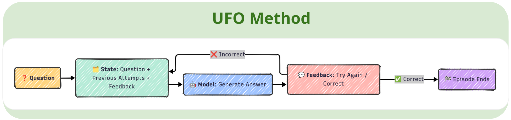
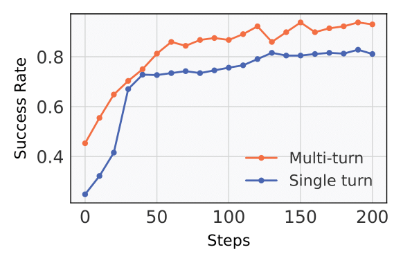
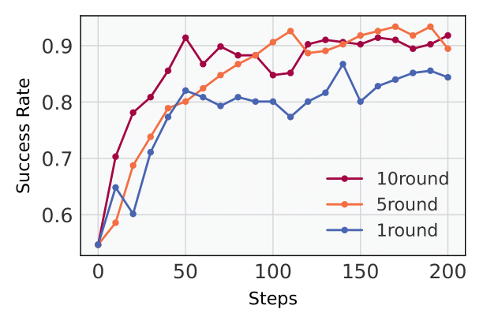
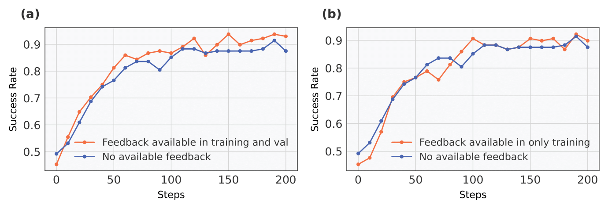

<h1 align="center"> <em>UFO</em>: A Simple "Try Again" Can Elicit Multi-Turn LLM Reasoning </h1>

<p align="center">
  <a href="https://huggingface.co/LichengLiu03/Qwen2.5-3B-UFO">
    
  </a>
  &nbsp;
  <a href="https://unary-feedback.github.io/">
    
  </a>
</p>

This project is led by the first author, who is currently applying to Ph.D. programs (Fall 2026). If you’re interested in my work, feel free to get in touch.

## Overview

**"Let's Try Again"** addresses a critical gap in language model training: while single-turn reinforcement learning (RL) improves reasoning, these models fail in **multi-turn interactive scenarios**, often repeating the same wrong answers despite feedback.

### Key Problem
Single-turn RL models lose the ability to revise reasoning across multiple turns. In 70% of failure cases, they produce identical answers across 5 interaction rounds, unable to incorporate simple feedback like "try again."

### Solution: UFO Framework
**Unary Feedback as Observation (UFO)** transforms static datasets into multi-turn training by:
- Using only minimal feedback signals ("Try Again")
- Treating failure feedback as part of the observation
- Enabling models to learn from historical mistakes

### Results
- **14% improvement** in multi-turn success rates
- **10% reduction** in average interaction turns
- Better performance even in single-turn scenarios
- **90% non-repetitive answers** (vs 80% baseline)

### Impact
UFO enables effective multi-turn RL training on existing static datasets without expensive annotations, making it practical to train models that can learn from sparse feedback and improve iteratively through trial-and-error, just like humans do.

## Framework

The UFO framework transforms static single-turn datasets into multi-turn interactive training through a simple yet effective approach.

<p align="center"></p>
<p align="center" style="font-size: 16px; max-width: 800px; margin: 0 auto;">
The UFO framework flow: Static datasets are transformed into multi-turn episodes where models receive minimal feedback ("Try Again") and learn to revise their reasoning across multiple attempts.
</p>

### Problem Formulation

We model multi-turn problem solving as a finite-horizon Markov Decision Process (MDP) where:
- **State**: Encodes the original question and history of past attempts with feedback
- **Action**: All possible answers the model can generate
- **Reward**: Binary signal (1 for correct, 0 for incorrect)
- **Transition**: Agent generates answer, receives feedback, episode continues until success or max turns

### Unary Feedback as Observation (UFO)

The core innovation is treating minimal feedback as part of the observation:

```
Question: What is the value of x + y?
Attempt 1: [wrong answer]
Feedback: Try Again.
Attempt 2: [correct answer]
```

**Key Features:**
- Only **negative feedback** (e.g., "Try Again") is included in context
- No positive confirmation signals are ever shown
- Model must learn to revise based solely on failure history
- Episodes terminate immediately upon correct answer

### Training with PPO

We use Proximal Policy Optimization (PPO) to train the policy:
- Agent observes input with full interaction history
- Generates answer and receives binary reward
- Policy updates using clipped surrogate objective
- Value function provides advantage estimates for stable training

### Reward Design

Two complementary strategies encourage efficient reasoning:

**1. Exponential Reward Decay:**
```
DecayReward(t) = γ^t if correct, 0 otherwise
```
Favors solving problems in fewer turns.

**2. Repetition Penalty:**
```
Penalty(τ) = λ · (1 - E(τ)/T)
```
Penalizes duplicate answers, encouraging diverse reasoning strategies.

This framework enables effective multi-turn RL training on static datasets without requiring expensive annotations or complex environments.

## Environment Setup
For detailed setup instructions, please check our [documentation](https://ragen-tutorial.readthedocs.io/). Here's a quick start guide:

```bash
# Setup environment and download data (2.7MB)
bash scripts/setup_ragen.sh
```

If this fails, you can follow the manual setup instructions in `scripts/setup_ragen.md`.

## Training Models
Here's how to train models with RAGEN framework:

### Export variables and train
We provide default configuration in `config/base.yaml`. This file includes symbolic links to:
- `config/ppo_trainer.yaml` 
- `config/envs.yaml`

The base configuration automatically inherits all contents from these two config files, creating a unified configuration system.

To train:

```bash
python train.py --config-name base
```

### Parameter efficient training with LoRA
We provide a default configuration with LoRA enabled in `config/base-lora.yaml`. To customize the LoRA settings, see the the `lora` section at the top of the configuration file.

To train with LoRA:

```bash
python train.py --config-name base-lora
```

<!--
## Supervised Finetuning (Optional)
For supervised finetuning with LoRA:

1. Create supervised finetuning data:
```bash
bash sft/generate_data.sh <env_type>
```

2. Finetune the model:
```bash
bash sft/finetune_lora.sh <env_type> <num_gpus> <save_path>
```

3. Merge LoRA weights with the base model:
```bash
python sft/utils/merge_lora.py \
    --base_model_name <base_model_name> \
    --lora_model_path <lora_model_path> \
    --output_path <output_path>
```
-->

## Visualization
Check `val/generations` in wandb

## Evaluation
UFO provides a easy way to evaluate a model inherited from RAGEN:
```bash
python -m ragen.llm_agent.agent_proxy --config-name <eval_config>
```
You only need to set model and environment to evaluate in `config/<eval_config>.yaml`.

## Key Results

### Multi-Turn Reasoning Performance

We compare our multi-turn UFO model against a strong single-turn PPO baseline. For a fair comparison, the baseline is evaluated on 5 independent samples (Pass@5), while our model uses 5 sequential attempts with feedback (Succ@5). Success is recorded if any of the 5 responses is correct. We also analyze the impact of varying the maximum number of interaction turns at training.

<p align="center">


</p>
<p align="center" style="font-size: 14px; color: #666;">
Left: Multi-turn (5-turn) RL significantly outperforms single-turn baseline. Right: Performance comparison with different training turns (1, 5, and 10).
</p>

**Key Findings:**
- **+14% success rate** over single-turn PPO baseline
- Benefits generalize to both multi-turn and single-turn inference
- Best results with 5-turn training; more turns yield diminishing returns

### Effectiveness of Unary Feedback

To further investigate the role of unary feedback, we compare model performance under different feedback availability conditions. In scenario (a), unary feedback is provided during both training and validation phases, while in scenario (b), unary feedback is available only during training but not at validation. The results show that access to unary feedback during both phases substantially improves validation success rate. In contrast, providing unary feedback solely during training does not yield improvements, indicating that the benefit of unary feedback is contingent on its availability at inference time.

<p align="center"></p>
<p align="center" style="font-size: 14px; color: #666;">
Success rate comparison under different unary feedback settings: (a) feedback in both training and validation; (b) feedback only in training.
</p>

**Key Insights:**
- Feedback in both training and validation is crucial for improvement
- Feedback only in training phase does **not** help at inference

### Reward Design Impact

**Exponential Reward Decay:**
- Decreases the average number of actions required to solve problems by ~10%
- Encourages faster and more efficient problem solving

**Answer Diversity:**
- Non-repetitive answer ratio increases from 79.7% to 92.8%
- Multi-turn RL with UFO encourages answer diversity and strengthens robustness


## Acknowledgements

We thank the [DeepSeek](https://github.com/deepseek-ai/DeepSeek-R1) team for providing the DeepSeek-R1 model and early conceptual inspirations. We are grateful to the [veRL](https://github.com/volcengine/verl) team for their infrastructure support and the [RAGEN](https://github.com/RAGEN-AI/RAGEN) team for their multi-turn RL framework. 
