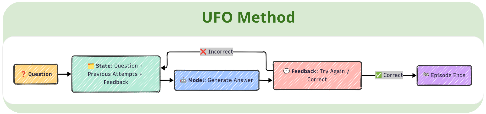

<h1 align="center"> <em>Let's Try Again</em>: Eliciting Multi-Turn Reasoning in Language Models via Simplistic Feedback </h1>


## Overview

**"Let's Try Again"** addresses a critical gap in language model training: while single-turn reinforcement learning (RL) improves reasoning, these models fail in **multi-turn interactive scenarios**, often repeating the same wrong answers despite feedback.

### Key Problem
Single-turn RL models lose the ability to revise reasoning across multiple turns. In 70% of failure cases, they produce identical answers across 5 interaction rounds, unable to incorporate simple feedback like "try again."

### Solution: UFO Framework
**Unary Feedback as Observation (UFO)** transforms static datasets into multi-turn training by:
- Using only minimal feedback signals ("Try Again")
- Treating failure feedback as part of the observation
- Enabling models to learn from historical mistakes

### Results
- **14% improvement** in multi-turn success rates
- **10% reduction** in average interaction turns
- Better performance even in single-turn scenarios
- **90% non-repetitive answers** (vs 80% baseline)

### Impact
UFO enables effective multi-turn RL training on existing static datasets without expensive annotations, making it practical to train models that can learn from sparse feedback and improve iteratively through trial-and-error, just like humans do.

## Framework

The UFO framework transforms static single-turn datasets into multi-turn interactive training through a simple yet effective approach.

<p align="center"></p>
<p align="center" style="font-size: 16px; max-width: 800px; margin: 0 auto;">
The UFO framework flow: Static datasets are transformed into multi-turn episodes where models receive minimal feedback ("Try Again") and learn to revise their reasoning across multiple attempts.
</p>

### Problem Formulation

We model multi-turn problem solving as a finite-horizon Markov Decision Process (MDP) where:
- **State**: Encodes the original question and history of past attempts with feedback
- **Action**: All possible answers the model can generate
- **Reward**: Binary signal (1 for correct, 0 for incorrect)
- **Transition**: Agent generates answer, receives feedback, episode continues until success or max turns

### Unary Feedback as Observation (UFO)

The core innovation is treating minimal feedback as part of the observation:

```
Question: What is the value of x + y?
Attempt 1: [wrong answer]
Feedback: Try Again.
Attempt 2: [correct answer]
```

**Key Features:**
- Only **negative feedback** (e.g., "Try Again") is included in context
- No positive confirmation signals are ever shown
- Model must learn to revise based solely on failure history
- Episodes terminate immediately upon correct answer

### Training with PPO

We use Proximal Policy Optimization (PPO) to train the policy:
- Agent observes input with full interaction history
- Generates answer and receives binary reward
- Policy updates using clipped surrogate objective
- Value function provides advantage estimates for stable training

### Reward Design

Two complementary strategies encourage efficient reasoning:

**1. Exponential Reward Decay:**
```
DecayReward(t) = γ^t if correct, 0 otherwise
```
Favors solving problems in fewer turns.

**2. Repetition Penalty:**
```
Penalty(τ) = λ · (1 - E(τ)/T)
```
Penalizes duplicate answers, encouraging diverse reasoning strategies.

This framework enables effective multi-turn RL training on static datasets without requiring expensive annotations or complex environments.

## Environment Setup
For detailed setup instructions, please check our [documentation](https://ragen-tutorial.readthedocs.io/). Here's a quick start guide:

```bash
# Setup environment and download data (2.7MB)
bash scripts/setup_ragen.sh
```

If this fails, you can follow the manual setup instructions in `scripts/setup_ragen.md`.

## Training Models
Here's how to train models with RAGEN:

### Export variables and train
We provide default configuration in `config/base.yaml`. This file includes symbolic links to:
- `config/ppo_trainer.yaml` 
- `config/envs.yaml`

The base configuration automatically inherits all contents from these two config files, creating a unified configuration system.

To train:

```bash
python train.py --config-name base
```

### Parameter efficient training with LoRA
We provide a default configuration with LoRA enabled in `config/base-lora.yaml`. To customize the LoRA settings, see the the `lora` section at the top of the configuration file.

To train with LoRA:

```bash
python train.py --config-name base-lora
```

<!--
## Supervised Finetuning (Optional)
For supervised finetuning with LoRA:

1. Create supervised finetuning data:
```bash
bash sft/generate_data.sh <env_type>
```

2. Finetune the model:
```bash
bash sft/finetune_lora.sh <env_type> <num_gpus> <save_path>
```

3. Merge LoRA weights with the base model:
```bash
python sft/utils/merge_lora.py \
    --base_model_name <base_model_name> \
    --lora_model_path <lora_model_path> \
    --output_path <output_path>
```
-->

## Visualization
Check `val/generations` in wandb


## Performance

We evaluate RAGEN across multiple environments. Below are results Qwen-2.5-0.5B-Instruct on Sokoban, Frozenlake, and Bandit. 
- No KL loss or KL penalty was applied during training
- We selectively retained only the top 25% of trajectories that successfully completed their respective tasks

<p align="center" style="display: flex; justify-content: center; align-items: center; flex-direction: column; gap: 20px; max-width: 500px; margin: 0 auto;">
    
    
    
</p>

We demonstrate RAGEN's robust generalization ability by training on simple Sokoban environments (6×6 with 1 box) and successfully evaluating performance on:
- Larger Sokoban environments (8×8 with 2 boxes)
- Simple Sokoban with alternative grid vocabulary representations
- FrozenLake environments

<p align="center" style="display: flex; justify-content: center; align-items: center; flex-direction: column; gap: 20px; max-width: 500px; margin: 0 auto;">
    
    
    
</p>

Key observations:
- By using no KL and filtering out failed trajectories, we can achieve better and stable performance
- Generalization results highlight RAGEN's capacity to transfer learned policies across varying environment complexities, representations, and domains.

